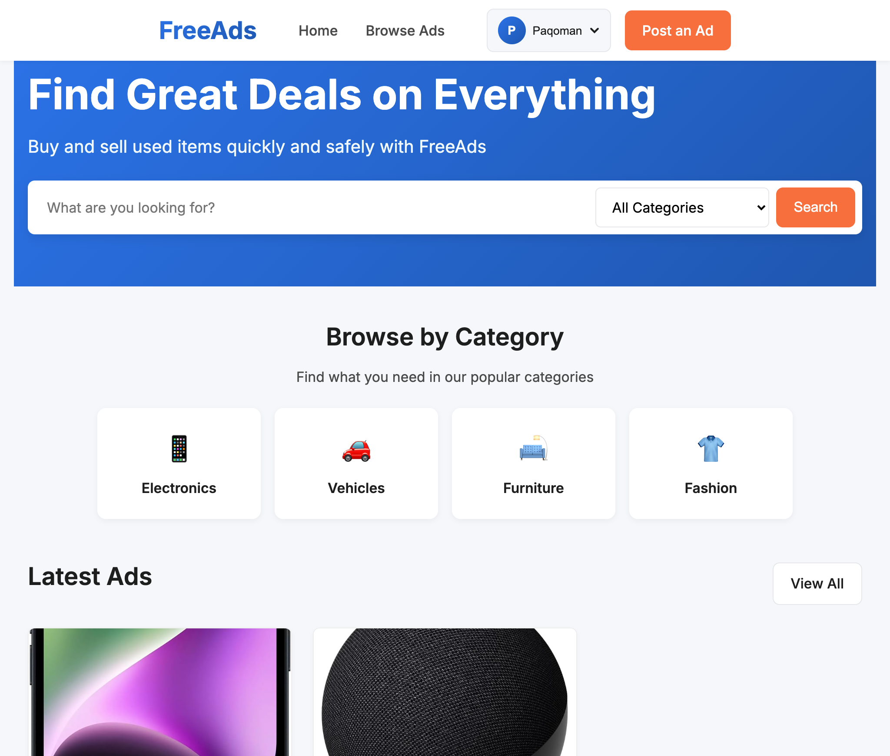
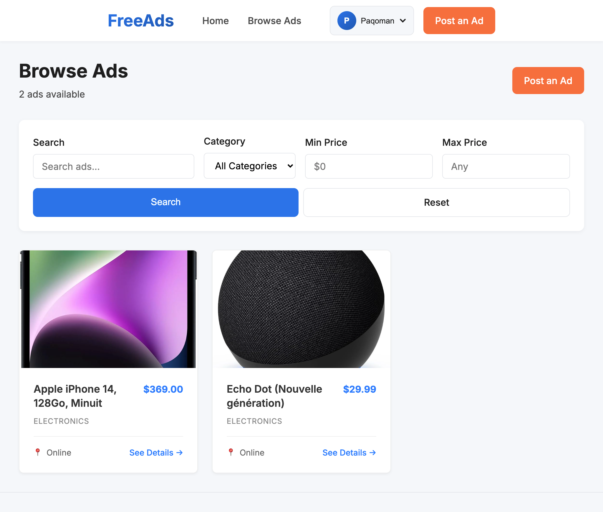
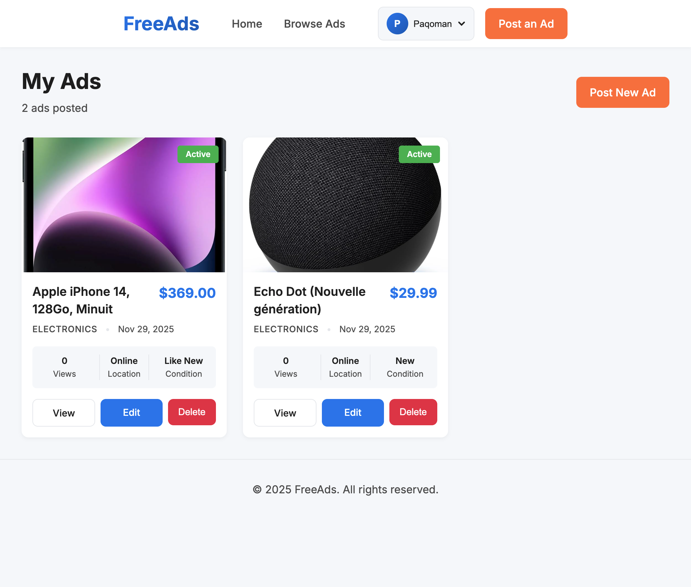

# FreeAds

FreeAds is a modern, minimalistic, and user-friendly platform for posting and browsing classified ads. It aims to provide an intuitive and trustworthy environment where users can sell, buy, or exchange items quickly and safely.

## Features

### Authentication & User Management
- **User Registration & Login**: Secure authentication system.
- **Email Verification**: Mandatory email verification flow to ensure user authenticity.
- **Profile Management**: Users can update their username, email, phone number, and password.

### Ads Management
- **Create Ads**: Registered users can post new ads with title, description, price, category, condition, location, and image URL.
- **Browse Ads**: Publicly accessible list of all ads with a clean layout.
- **View Details**: Detailed view for each ad showing seller information and contact details.
- **Edit/Delete**: Users can manage their own ads.

### Search & Discovery
- **Keyword Search**: Search ads by title or description.
- **Filtering**: Filter ads by Category (Electronics, Vehicles, Furniture, etc.) and Price Range.
- **Responsive Design**: Fully optimized for mobile, tablet, and desktop devices.

## Screenshots

|                   Home Page                    |               Ads Listing                |
| :--------------------------------------------: | :--------------------------------------: |
|         |  |
|                 **Ad Details**                 |                **My Ads**                |
|  |    |


## Tech Stack

-   **Backend**: [Laravel 12](https://laravel.com) (PHP 8.2+)
-   **Database**: MySQL
-   **Frontend**: Blade Templates, [TailwindCSS 4](https://tailwindcss.com)
-   **Build Tool**: [Vite](https://vitejs.dev)

## Prerequisites

Before you begin, ensure you have the following installed:
-   PHP >= 8.2
-   Composer
-   Node.js & npm
-   MySQL

## Installation

1.  **Clone the repository**:
    ```bash
    git clone https://github.com/Paqoman8/free_ads.git
    cd free_ads
    ```

2.  **Install PHP dependencies**:
    ```bash
    composer install
    ```

3.  **Install and build frontend assets**:
    ```bash
    npm install
    npm run build
    ```

4.  **Environment Configuration**:
    - Copy the example environment file:
      ```bash
      cp .env.example .env
      ```
    - Update the `.env` file with your database credentials:
      ```dotenv
      DB_CONNECTION=mysql
      DB_HOST=127.0.0.1
      DB_PORT=3306
      DB_DATABASE=freeads
      DB_USERNAME=root
      DB_PASSWORD=root
      ```
    - Configure Mail settings (e.g., using Mailtrap or Log driver):
      ```dotenv
      MAIL_MAILER=log
      ```

5.  **Generate Application Key**:
    ```bash
    php artisan key:generate
    ```

6.  **Run Migrations**:
    ```bash
    php artisan migrate
    ```

7.  **Serve the Application**:
    ```bash
    php artisan serve
    ```
    Access the app at [http://localhost:8000](http://localhost:8000).

## Usage

1.  **Register**: Create a new account via the "Register" link.
2.  **Verify Email**: Check your configured mail driver (or `storage/logs/laravel.log` if using `log` driver) for the verification link.
3.  **Post an Ad**: Click "Post an Ad" in the navigation bar to list an item.
4.  **Browse & Search**: Use the search bar and filters on the home page to find items.
5.  **Manage Profile**: Access your profile to update your information or change your password.

## Design System

For a deeper dive into the design philosophy and guidelines, check the [Docs](Docs/) directory:
-   [Brand Overview](Docs/brand-overview.md)
-   [Design System Summary](Docs/design-system-summary.md)
-   [Color Palette](Docs/color-palette.md)
-   [Typography](Docs/typography.md)

## Contributing

Contributions are welcome! Please see [CONTRIBUTING.md](CONTRIBUTING.md) for details on how to contribute to this project.

## License

This project is licensed under the MIT License - see the [LICENSE](LICENSE) file for details.
